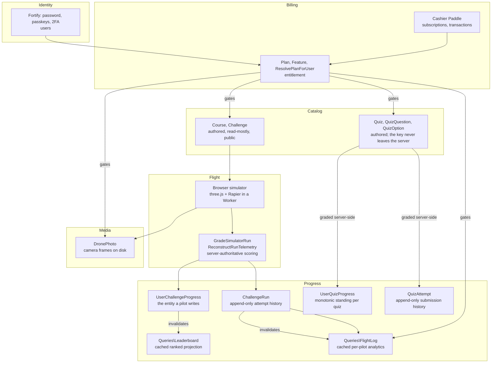
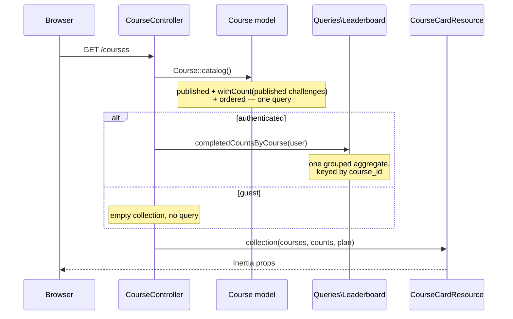
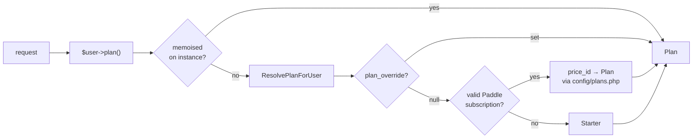
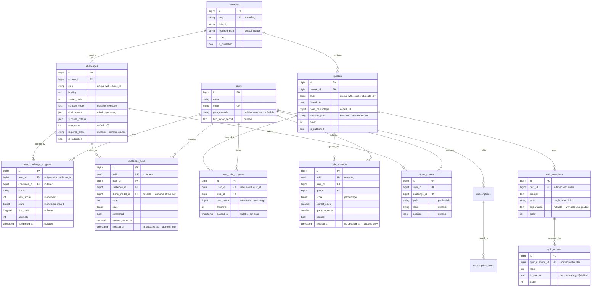

# DroneVerse Architecture

How the application is put together today, why it is put together that way, and
what has to change at each point where growth would break it.

This is an engineering document. For what the product sells, see
[pricing.md](pricing.md). For the coding conventions this architecture assumes,
see `CLAUDE.md` at the repository root.

**Contents**

1. [Context and bounded contexts](#1-context-and-bounded-contexts)
2. [Component structure](#2-component-structure)
3. [Data flow](#3-data-flow)
4. [API design](#4-api-design)
5. [Database schema and index strategy](#5-database-schema-and-index-strategy)
6. [Caching strategy](#6-caching-strategy)
7. [Deployment and scaling topology](#7-deployment-and-scaling-topology)
8. [Known divergences](#8-known-divergences)

---

## 1. Context and bounded contexts

DroneVerse is a browser-based drone programming platform. A pilot writes code,
flies a simulated drone against a mission's objectives, and is scored. Scores
accumulate into per-mission progress and a global ranking. Access to missions is
sold as a subscription.

The codebase separates into five contexts. They are not packages — this is a
single Laravel application — but they are the seams along which the code is
organised, and the seams that would become services if this ever had to split.



Quizzes sit inside Catalog rather than beside it, and they are gated by the
same arrow as the missions: a `Quiz` states a `required_plan` and knows nothing
about what a `Plan` is, exactly as a `Course` does. Note what has no arrow —
nothing runs from quiz progress to the leaderboard or to `FlightLog`. Those two
rank and analyse *flying*, and neither reads a quiz, which is why
`RecordQuizAttempt` invalidates no cache. When quiz results start appearing on
either, that arrow and that invalidation appear together.

**The dependency rule that matters:** entitlement points *into* catalog and
media, never out. `Plan` knows nothing about a `Course`; a `Course` states which
`Plan` reaches it. That direction is what lets a new tier ship without touching
content, and content ship without touching billing.

**The other rule that matters:** the browser is never trusted with a result.
`resources/js/lib/simulator/grader.ts` scores a run the instant the pilot lands,
so the UI is immediate — but that copy is a *preview*. `StoreChallengeAttemptRequest`
does not accept a score, a star count, or a claim of completion. It accepts a
flight path and a collision count; `ReconstructRunTelemetry` works out what that
flight achieved against the mission's own geometry, and `GradeSimulatorRun`
decides what it was worth. The two graders share a policy that
`tests/Feature/ChallengeTest.php` pins.

### Context ownership

| Context | Owns | Entry points |
| --- | --- | --- |
| Identity | `users`, passkeys, 2FA columns | Fortify routes, `routes/settings.php` |
| Catalog | `courses`, `challenges`, `quizzes`, `quiz_questions`, `quiz_options` | `routes/courses.php` (GET) |
| Flight | none (stateless grading) | `POST .../attempts` |
| Progress | `user_challenge_progress`, `challenge_runs`, `user_quiz_progress`, `quiz_attempts` | `RecordChallengeAttempt`, `RecordQuizAttempt`, `Queries\Leaderboard`, `Queries\FlightLog` |
| Billing | `customers`, `subscriptions`, `subscription_items`, `transactions`, `users.plan_override` | `routes/billing.php`, Paddle webhook |
| Media | `drone_photos`, the `public` disk | `POST .../photos`, `routes/courses.php` |

---

## 2. Component structure

```
app/
├── Actions/          write-side business logic, one public handle()
├── Queries/          cached read models over aggregates
├── Http/
│   ├── Controllers/  HTTP shape only
│   ├── Requests/     payload validation and casting
│   ├── Resources/    server state → client props
│   └── Middleware/   cross-cutting request concerns
├── Models/           persistence, relations, and questions about one row
├── Enums/            closed domain vocabularies
├── Concerns/         traits that answer questions on a model
├── Policies/         per-model authorization
└── Providers/        container bindings, gates, framework defaults
```

### Where a given piece of logic belongs

| If it… | It goes in | Example |
| --- | --- | --- |
| changes state, and could be called from HTTP, a queue, a command or a test | `app/Actions` | `RecordChallengeAttempt` |
| reads and aggregates across many rows, and is cached | `app/Queries` | `Leaderboard` |
| answers a question about **one** row from its own columns | the model | `Challenge::isPlayableIn()` |
| answers a question about a user's entitlements | `app/Concerns/HasPlan` | `$user->hasFeature()` |
| shapes or validates an inbound payload | `app/Http/Requests` | `StoreChallengeAttemptRequest` |
| shapes an outbound payload | `app/Http/Resources` | `ChallengeDetailResource` |
| is a fixed set of named domain values | `app/Enums` | `Plan`, `Feature`, `ChallengeStatus` |

A controller is allowed to: resolve route bindings, `abort_unless` on
playability and entitlement, call actions and queries, and render. Everything
else is a smell. `ChallengeController::store()` is the reference shape —
two guards, three collaborators injected as method parameters, one response.

### Why `Queries` is separate from `Models`

This is the newest seam, and worth stating explicitly because it looks like
duplication. `UserChallengeProgress` is a row a pilot owns and writes to.
`Queries\Leaderboard` is a cached, ranked projection over *all* of them, with
its own caching policy, lock tuning, and raw SQL. They change for different
reasons and at different rates. Keeping them apart means changing how the board
is cached does not mean editing the model that records attempts.

The rule generalises: **an aggregate read over many rows that needs its own
caching policy is a Query object, not a static method on the entity.**

### Frontend

```
resources/js/
├── pages/            Inertia page components, one per route
├── layouts/          app / auth / settings shells
├── components/       ui/ (primitives), simulator/, marketing/
├── lib/simulator/    the flight engine — physics, telemetry, grading, worker
├── hooks/
├── actions/ routes/  Wayfinder-generated, typed, do not hand-edit
└── types/
```

The simulator is the one genuinely heavy client subsystem. It runs physics in a
Web Worker (`lib/simulator/worker.ts`) with a `SharedArrayBuffer`-free message
protocol via `worker-client.ts`, samples telemetry off the frame loop at 20 Hz
(`telemetry.ts`), and batches console output rather than re-rendering per line.
`three.js` is split into its own chunk at build time. Photo uploads go through
`upload-queue.ts` so a burst of captures does not become a burst of requests.

**Wayfinder** (`@/actions`, `@/routes`) generates typed callers for every named
route. Frontend code must never hand-write a URL; a route rename should be a
TypeScript error, not a 404 in production.

---

## 3. Data flow

### 3.1 Catalog read (the common case)



The catalog is public and identical for every viewer; only the *progress overlay*
is per-user. Those are two queries, never N+1 — the counts arrive as one
`course_id => completed` map that the resource merges in memory.
`Model::preventLazyLoading()` is armed everywhere except production, so a
regression here fails the test suite rather than the production database.

### 3.2 The attempt write path (the hot path)

This is the request that costs the most and runs the most. It is worth reading
end to end.

```mermaid
sequenceDiagram
    participant B as Browser
    participant T as throttle:30,1
    participant Rq as StoreChallengeAttemptRequest
    participant Ct as ChallengeController
    participant Re as ReconstructRunTelemetry
    participant G as GradeSimulatorRun
    participant A as RecordChallengeAttempt
    participant DB as Database
    participant L as Leaderboard

    B->>T: POST /courses/{c}/challenges/{ch}/attempts
    Note over B: { code, path[], collisions, photos[] }
    T->>Rq: validate
    Note over Rq: one closure over the whole path array,<br/>validating and casting in a single walk
    Rq->>Ct: run()
    Ct->>Ct: abort_unless(isPlayableIn) → 404
    Ct->>Ct: abort_unless(isUnlockedFor) → 403
    Ct->>Re: handle(challenge, run)
    Note over Re: replay path against mission geometry:<br/>waypoints hit, photo targets, landing, timing
    Re->>G: telemetry
    Note over G: objectives 70 / landing 20 / time 10,<br/>−10 per collision, scaled to max_score
    G->>A: {score, stars, completed, code}
    A->>DB: firstOrCreate(user, challenge)
    A->>DB: BEGIN; lockForUpdate; merge; save; COMMIT
    Note over A: best_score and stars only ever rise;<br/>completed is permanent
    A->>L: forget()  — bump generation counter
    Ct-->>B: 200 { result, progress }
```

Three properties this path is built to hold:

1. **Validation is bounded and cheap.** A 4 000-sample path validated with
   `path.*.x` wildcard rules expands to ~16 000 attributes, each carrying rule
   objects resolved through the validator's message machinery, and rebuilt on
   every `validated()` call — measured at 2.5 s of CPU and 10 MB, to guard
   geometry that costs under 4 ms. One closure over the array is ~1 ms. The
   ceilings (`MAX_PATH_SAMPLES`, `MAX_SAMPLE_GAP_SECONDS`) exist to bound the
   work, not to pace honest pilots.
2. **Concurrent submissions cannot lose an update.** The `firstOrCreate` runs
   *outside* the transaction so the insert cannot deadlock against the row lock;
   the merge runs inside it with `lockForUpdate`.
3. **The guards are repeated here, not inherited from the page.** Nothing stops
   a client posting straight at this endpoint. A locked mission that still
   accepts attempts is not locked — it just has no link.

### 3.3 Entitlement resolution



Ordered by authority, most authoritative first. An override outranks Paddle
deliberately — it exists precisely to say something billing does not know
(comped, staff, academic, pre-launch backfill). An unrecognised price ID
resolves to `null`, never to a default plan: an ID we cannot account for is a
configuration error, and silently granting Pro for it is worse than granting
nothing.

Resolution is **memoised on the `User` instance**, not in a cache. A fresh
`User` is hydrated per request, so the memo lives exactly as long as it should
and there is nothing to invalidate when a subscription changes. `forgetPlan()`
covers the one case that needs it.

Two independent axes, deliberately not collapsed into one:

- `Plan::covers()` — *catalogue depth*. Which missions this tier reaches.
- `Plan::features()` — *capabilities*. Registered one-to-one as Gates in
  `AppServiceProvider`, so `->middleware('can:python_runtime')`,
  `$user->can(...)` and the React feature list all answer identically. Adding a
  `Feature` case registers its gate with no further wiring.

`HandleInertiaRequests` shares the resolved plan and its granted feature list
with every page. That is **a rendering hint and nothing more** — every gated
capability is still enforced server-side by its own Gate or `abort_unless`.

### 3.4 Billing

Paddle-hosted checkout; we never see card details. The webhook is the only
endpoint in the application that grants paid access without a session behind it,
so `PaddleWebhookController` makes signature verification **unconditional** —
Cashier applies it only `if (config('cashier.webhook_secret'))`, which means an
environment that forgets `PADDLE_WEBHOOK_SECRET` fails *open*. With no secret
configured here, no signature matches and every call is rejected. A webhook
nobody can call is an outage; a webhook anybody can call is a breach.

Price IDs live in `config/plans.php`, read from the environment — never database
rows. The sandbox and production catalogues carry different IDs for the same
product, and a row would let a client-supplied value reach checkout.

---

## 4. API design

### 4.1 Two surfaces, on purpose

DroneVerse is **Inertia-first**. The primary interface is not a REST API — it is
server-rendered props delivered to React page components. There is no
serialisation contract to version, no client-side store to keep in sync, and
authorization happens where the data is fetched.

A second, small **JSON surface** exists for the interactions that happen *inside*
a page without navigation:

| Method | Path | Returns | Throttle | Why JSON |
| --- | --- | --- | --- | --- |
| `POST` | `/courses/{course}/challenges/{challenge}/attempts` | graded result + progress | `30,1` | the pilot stays in the simulator |
| `POST` | `/courses/{course}/challenges/{challenge}/photos` | `{id, url, label}` (201) | `120,1` | uploads are queued client-side |
| `DELETE` | `/photos/{photo}` | redirect back | — | Inertia form |

Everything else returns an Inertia response.

### 4.2 Conventions

- **Route model binding by slug** for catalog content (`{course:slug}`,
  `{challenge:slug}`) — URLs are the product's public surface and are shared,
  bookmarked and indexed. See §8 for the identifier policy on non-catalog models.
- **Nested paths express containment, not just hierarchy.** A challenge is
  addressed through its course because `isPlayableIn($course)` is a real check:
  a mismatched pair is indistinguishable from content that does not exist, and
  404s.
- **404 before 403.** Playability is checked first so a locked mission and a
  retired one are not distinguishable by a probe.
- **Throttles are sized to bound scripts, not to pace pilots.** A mission takes
  ≥10 s to fly and submits once; 30/min sits far above any honest pilot.
- **`shouldRenderJsonWhen`** in `bootstrap/app.php` renders errors as JSON for
  `api/*` and any `expectsJson()` request, so the in-page endpoints get
  machine-readable failures.

### 4.3 When a public API is needed

`Feature::ApiAccess` is sold on Enterprise and does not exist yet. When it
lands it should be a **separate, versioned surface**, not the in-page endpoints
opened up:

```
routes/api.php          →  /api/v1/*
app/Http/Controllers/Api/V1/
app/Http/Resources/Api/V1/     ← versioned resources; page resources stay free to change
```

Authenticated by Sanctum tokens, rate-limited per token rather than per session,
and — critically — with its own resource classes. The Inertia resources in
`app/Http/Resources` are page props and must stay free to change shape whenever
a page changes. Sharing them with a public API silently makes every page a
breaking-change surface.

---

## 5. Database schema and index strategy

### 5.1 Current schema



The two halves of the schema rhyme on purpose. `quizzes` is to `courses` what
`challenges` is — authored, slug-routed within its course, `required_plan`
nullable — and `user_quiz_progress`/`quiz_attempts` is to a quiz exactly what
`user_challenge_progress`/`challenge_runs` is to a mission: one monotonic row
the pilot owns, and one append-only row per graded submission. A reader who
knows the mission half already knows this one.

### 5.2 Design decisions worth keeping

**`required_plan` is nullable on `challenges`, non-null on `courses`.** Null
means "whatever my course says" — the common case by a wide margin, and the one
that keeps a course's missions from drifting apart from it. A challenge stores a
value only when it deliberately departs from its course, which is how Precision
Flight can be a browsable Starter course whose missions are all Pro.

**`environment` and `success_criteria` are JSON.** Mission geometry is authored
data read whole by one consumer (`ReconstructRunTelemetry`) and never queried
across. Normalising it would buy nothing and cost a join per mission load.

**Progress is monotonic.** `best_score` and `stars` only rise; `completed_at` is
set once with `??=`. A bad run can never take away a good one, which means the
leaderboard needs no history to be correct.

**`user_challenge_progress` has a `(user_id, challenge_id)` unique key.** It is
both the correctness constraint and the index that serves the per-pilot lookup
on the hot path. `user_quiz_progress` carries the same key on `(user_id,
quiz_id)`, for both of the same reasons — and it is what makes the
firstOrCreate-then-lock in `RecordQuizAttempt` safe under a double-submitted
form: two racing submissions collide on the constraint, then serialize on the
row.

**`quiz_options.is_correct` is the answer key, and it is defended twice.** The
shape that reaches the browser is built by hand in `QuizDetailResource` — id and
label, nothing else — and `QuizOption` additionally hides the column from
serialization, so a stray `toArray()`, a debug dump or an accidentally
eager-loaded relation cannot leak it either. `quiz_questions.explanation` is
withheld on the same shape for the same reason: on a well-written question,
saying *why* an answer is right gives the answer away as surely as the flag
does. Both travel only through `QuizResultResource`, after grading, when there
is nothing left to give away. This is the `challenges.solution_code`
arrangement, applied to a table where every row carries a secret.

**A quiz is scored as a percentage, not a point total.** `pass_percentage` on
the quiz and `best_score` on the progress row are both percentages, which is
what lets an author add a question to a published quiz without moving the bar
underneath the pilots who already cleared it. It is also why there is no
`points` column on `quiz_questions`: weighting only means something once an
author has a reason to say one question matters more, and a column nobody sets
still has to be read, summed and defended by the grader.

**Quiz progress is monotonic, and `passed_at` is the authority on a pass.**
`best_score` only rises and `passed_at` is set once with `??=`, never cleared.
Retakes are unlimited, which is what makes that guarantee necessary rather than
merely kind — a pilot reopening a quiz to review the questions must not be able
to lose the pass they hold. Deriving "passed" from `best_score >=
pass_percentage` instead would silently revoke passes the moment an author
raised the bar.

**`quiz_attempts` does not store the chosen answers.** Per-option answer history
is a much wider and faster-growing table, it is only worth building once someone
is actually asking which distractor pilots fall for, and it would tie a pilot's
history to question rows that authors replace wholesale on every re-seed. The
counts are what a history reads.

### 5.3 Index strategy

Progress outgrows every other table here by orders of magnitude — it is
`users × challenges` — so it is the table that decides whether the board stays
cheap.

| Index | Serves |
| --- | --- |
| `ucp (user_id, challenge_id)` unique | the hot-path lookup in `RecordChallengeAttempt`; per-pilot aggregates |
| `ucp_challenge_id_index` | the join out to `challenges` in every board aggregate. The unique key leads with `user_id`, so it **cannot** serve a lookup by challenge — without this, board queries scan |
| `challenges (course_id, is_published)` | the per-course board, and the published-challenge count on every catalog card |
| `courses.slug` unique | route binding |
| `challenges (course_id, slug)` unique | route binding, scoped to the course |
| `quizzes (course_id, slug)` unique | route binding, scoped to the course — the same key `challenges` carries, so two courses may both have a `final-exam` |
| `quiz_questions (quiz_id, order)` | the whole quiz, in author order, for the page and the grader alike |
| `quiz_options (quiz_question_id, order)` | the options of a question, in author order |
| `uqp (user_id, quiz_id)` unique | the hot-path lookup in `RecordQuizAttempt`, and the per-page progress merge on the course page |
| `quiz_attempts (user_id, quiz_id, id)` | one pilot's submission history on one quiz, in order. Leads with `id` rather than `created_at` so two submissions in the same second still sort, and the read never leaves the index |
| `quiz_attempts (quiz_id)` | pass rates and score distributions across every pilot. The index above leads with `user_id`, so it **cannot** serve a lookup that names no pilot |

The quiz indexes are sized for a table that is *not* the one that decides the
board. `user_quiz_progress` grows as `users × quizzes`, and quizzes are a
handful per course against dozens of missions — it is an order of magnitude
smaller than `user_challenge_progress` and will stay that way. The pair on
`quiz_attempts` mirrors `challenge_runs` not because the volume demands it yet,
but because the two tables answer the same shaped questions and a reader should
not have to work out why one is indexed differently.

Every board aggregate reads through `Leaderboard::playable()` — published
challenge inside a published course — so "playable" means exactly one thing
everywhere, and retiring either end retires the progress from all aggregates at
once with no predicate left behind to drift.

### 5.4 Schema the roadmap will need

Not built. Recorded here so the shape is agreed before it is urgent.

- ~~**`challenge_runs`** — an append-only row per submitted attempt.~~ **Built.**
  `2026_08_04_080633_create_challenge_runs_table`: `uuid`, `user_id`,
  `challenge_id`, `score`, `stars`, `completed`, `objectives_hit`,
  `objectives_total`, `collisions`, `elapsed_seconds`, `landed`, `timed_out`,
  `created_at` — no `updated_at`, because nothing revises a graded run.
  `RecordChallengeAttempt` writes it inside the same transaction as the
  progress merge, so a run and its merge cannot come apart. Progress remains
  the hot read path; this cost one insert.
  `app/Queries/FlightLog.php` is the read model over it and
  `Feature::AdvancedAnalytics` now has its source data.
  **Still owed:** a monthly roll-off or partition. This is the fastest-growing
  table in the schema and nothing prunes it yet — and `quiz_attempts` now has
  the same debt on the same terms, so whatever retention policy lands should
  cover both rather than being written twice.
  Two indexes carry it: `(user_id, challenge_id, id)` puts the per-pilot
  attempt curve entirely inside an index — leading with `id` rather than
  `created_at` so two runs in the same second still order — and
  `(challenge_id)` serves the cohort aggregates, which name no pilot and so
  cannot use the first.
- ~~**quiz tables** — a knowledge check per course.~~ **Built.**
  `2026_08_06_215721`–`215725`: `quizzes`, `quiz_questions`, `quiz_options`,
  `user_quiz_progress`, `quiz_attempts`. Gated by course tier through
  `Quiz::requiredPlanIn()`, graded server-side by `GradeQuizSubmission`, merged
  and logged in one transaction by `RecordQuizAttempt`. See §5.1–§5.3.
  **Still owed:** the retention policy noted above, and an authoring surface —
  quizzes are seeded content today, with no UI to write one.
- **`teams` / `team_members`** — `Plan::Team` sells ten seats and
  `ResolvePlanForUser` already documents where the `fromTeamMembership()` branch
  slots in: between the subscription and the Starter fallback.
- **`last_code` off the hot row.** A `longText` column in
  `user_challenge_progress` is hydrated by every `firstOrFail()` on the attempt
  path. It is a draft buffer, not progress. Move it to its own table (or a
  cache entry) when row width starts to matter.

---

## 6. Caching strategy

Four layers, each with a different lifetime and a different invalidation story.

| Layer | Store | Lifetime | Invalidated by |
| --- | --- | --- | --- |
| Built assets | CDN / browser | content hash | a new build |
| Inertia shared props | none — per request | one request | — |
| Resolved plan | in-memory, on the `User` instance | one request | `forgetPlan()` |
| Leaderboard slices | cache store | 300 s, or a generation bump | `Leaderboard::forget()` |

Only the last is a real cache with a real invalidation problem.

### 6.1 The leaderboard read model

Ranking is a full aggregate over the largest table in the schema, and the board
is read far more often than it changes. So every view of it is cached, keyed by
a **generation counter**:

```
leaderboard:{generation}:standings:{course|all}:{limit}
leaderboard:{generation}:standing:{course|all}:{user_id}
leaderboard:{generation}:pilots:{course|all}
```

Invalidation is one write. `forget()` bumps the counter; every old key simply
stops being looked up and ages out on its own. There is no hunt for which of the
per-course and per-viewer entries a given run could have moved.

Four details in `app/Queries/Leaderboard.php` that each fixed a real defect and
must not be undone:

1. **The counter is seeded with `Cache::add` before it is incremented.** Only
   some drivers treat `increment` on an absent key as counting up from zero; the
   database and memcached stores return `false` and write nothing. Without the
   seed, a generation no run had ever created stayed pinned at zero and *every
   invalidation silently did nothing*. `add` is the atomic create-if-absent, and
   creating the counter **is** the first bump, so it never double-counts.
2. **Cached values are wrapped as `['value' => …]`.** A slice can legitimately
   be `null` — a pilot who has not flown has no standing — and a bare null is
   indistinguishable from a miss. Unwrapped, those pilots re-ran the ranking
   aggregate on every single page view.
3. **Only plain arrays cross the cache boundary.** Every serialising store
   unserialises through `cache.serializable_classes`, left at the framework
   default of `false` so a leaked `APP_KEY` cannot become a gadget chain. A
   cached `stdClass` query row therefore returns as `__PHP_Incomplete_Class` and
   fatals on first use — the board rendered on the miss that populated the cache
   and threw on every hit until expiry. Only the array store, which the test
   suite uses, could not see it. `standingRows()` is the boundary.
4. **Shared slices are built under a lock; per-viewer slices are not.** A run
   *anywhere* retires *every* cached view at once, so the moment one pilot
   submits, every leaderboard viewer misses simultaneously. Left alone they
   would each answer the miss with the same full aggregate, and the load would
   rise with traffic exactly when there is least room for it. Waiting is bounded
   (5 s) and never fatal: whoever times out computes the slice themselves, which
   is what every request did before. A per-viewer slice can only collide with
   that same pilot's own requests — no pile-up to hold a lock against, and
   taking one would just be two more cache writes on the miss.

### 6.2 The scaling cliff, stated plainly

The generation counter is global. One attempt anywhere retires the whole board.

Let *A* be attempts per second across all pilots and *B* the cost of rebuilding
a slice. The board's effective cached lifetime is `1/A` seconds, not the 300 s
TTL. Below roughly `A = 1/B` the cache absorbs reads normally. Above it, the
board is *permanently* rebuilding: the stampede lock stops that from becoming
*N* concurrent aggregates, but it converts them into a queue — viewers waiting
up to 5 s, then falling through and computing anyway.

For a full aggregate over a few million progress rows on indexed joins,
`B ≈ 100–300 ms`, which puts the cliff somewhere around **3–10 attempts per
second**. That is a healthy weekday, not a viral spike.

Three responses, in increasing order of cost:

**(a) Decouple invalidation from writes.** Stop bumping per attempt. Let the
board be up to *N* seconds stale (`forget()` on a throttled key, or TTL alone).
A leaderboard is a social object, not a ledger — 30 s of staleness is invisible
to pilots and removes the coupling entirely. This is roughly a ten-line change
and buys an order of magnitude.

**(b) Scope invalidation to what moved.** A run in course *X* cannot change the
board for course *Y*. Per-course generation counters make the global board the
only thing every run retires. Buys another order of magnitude and costs one
extra key per course.

**(c) Maintain the ranking incrementally.** Replace the aggregate with a Redis
sorted set per scope: `ZINCRBY` the delta on write, `ZREVRANGE` for a page,
`ZREVRANK` for a viewer's own position. Reads become O(log N) with no aggregate
at all, and writes stop invalidating anything. The cost is that the projection
is now durable state that can drift, so it needs a periodic rebuild from the
progress table as the source of truth.

`Queries\Leaderboard` is already the correct seam for all three: its public
surface is `standings()`, `standingFor()`, `rankedPilotCount()`, `forget()`.
None of (a), (b) or (c) changes a single caller.

### 6.3 What must not be cached

The resolved plan, beyond a request. Entitlement is read on every request and a
stale grant is a revenue and a support problem in both directions. The
per-instance memo is the correct scope and needs no invalidation story.

---

## 7. Deployment and scaling topology

### 7.1 Target topology

```mermaid
graph TB
    CDN[CDN — hashed assets, drone photos]
    LB[Load balancer / TLS]
    subgraph Web tier — stateless, horizontally scaled
        W1[PHP-FPM + nginx]
        W2[PHP-FPM + nginx]
    end
    subgraph Workers
        Q1[queue:work]
    end
    RD[(Redis — cache, sessions, locks, queue)]
    DB[(MySQL 8 primary)]
    RR[(read replica)]
    S3[(S3 — drone photos)]
    PAD[Paddle]

    CDN --> LB --> W1 & W2
    W1 & W2 --> RD
    W1 & W2 --> DB
    W1 & W2 -.reads.-> RR
    W1 & W2 --> S3
    Q1 --> RD & DB & S3
    PAD -->|webhook| LB
```

The web tier is stateless and must stay that way. Two things currently hold it
back from being so (§8): sessions default to the database and drone photos are
written to a local disk.

### 7.2 Configuration: development defaults vs. production requirements

`.env.example` is tuned for a zero-dependency local checkout. Every one of these
must change in production.

| Setting | `.env.example` | Production | Why |
| --- | --- | --- | --- |
| `DB_CONNECTION` | `sqlite` | `mysql` (8.0+) | `Leaderboard::standingsQuery()` uses `rank() over (…)`; the `place` alias exists because `rank` and `position` are MySQL reserved words. See §7.4. |
| `CACHE_STORE` | `database` | `redis` | The whole board read model exists to keep load off the database. Caching it *in* the database, with a `Cache::lock` that is also a database write, defeats the purpose. |
| `SESSION_DRIVER` | `database` | `redis` | Session writes on every request are the web tier's most frequent database write, and they are what makes it non-stateless. |
| `QUEUE_CONNECTION` | `database` | `redis` | See §7.3 — there is nothing on the queue yet, but there needs to be. |
| `FILESYSTEM_DISK` | `local` | `s3` | `StoreDronePhoto` writes to `Storage::disk('public')`. On more than one web node, a photo uploaded to node A 404s from node B. |
| `APP_ENV` | `local` | `production` | Arms `DB::prohibitDestructiveCommands()` and the 12-character/uncompromised password policy; disarms `preventLazyLoading` |

Deploy target is Laravel Cloud or equivalent. CI (`.github/workflows/`) runs
`composer ci:check`: ESLint, Prettier, `tsc`, Pint, PHPStan level 7, PHPUnit.

### 7.3 There is no asynchronous work, and there should be

`app/Jobs` does not exist. Every request does all of its own work inline. Two
things belong on a queue before traffic makes them urgent:

1. **Drone photo processing.** `StoreDronePhoto` currently base64-decodes the
   payload, runs `getimagesizefromstring`, and writes to disk — all inside the
   request, at up to 120 requests/minute/pilot. Validate and store the raw bytes
   inline (the safety check must stay synchronous), then queue thumbnailing and
   the move to S3.
2. **Leaderboard rebuilds**, if response (c) in §6.2 is taken.

Neither is a large change. Both are much larger changes once they are on fire.

### 7.4 The test suite does not run on the engine we ship

`phpunit.xml` pins `DB_CONNECTION=sqlite`, `DB_DATABASE=:memory:`,
`CACHE_STORE=array`, `SESSION_DRIVER=array`, `QUEUE_CONNECTION=sync`. The
development `.env` and production both run MySQL.

That is the right default for a fast suite, and most of it is harmless. Two
parts are not, because they are exactly where this application's hardest code
lives:

1. **The board's SQL is engine-specific.** `rank() over (order by …)` inside a
   `fromSub`, and the `place` alias that exists solely because `rank` and
   `position` are MySQL reserved words, are validated only against SQLite by
   CI. SQLite will happily accept a query MySQL rejects, and the failure would
   land in production on the leaderboard page.
2. **The cache store's semantics differ in ways the read model depends on.**
   `Leaderboard::forget()` seeds the generation counter with `Cache::add`
   precisely because the database and memcached stores return `false` from
   `increment` on an absent key while other stores count up from zero. The
   array store the suite uses cannot observe that difference — and it is the
   store that hid the `__PHP_Incomplete_Class` defect described in §6.1, item 3,
   because it alone keeps the live object instead of serialising it.

**Recommendation:** keep the fast SQLite suite as the default, and add a
scheduled or pre-merge CI job that runs the same suite against a MySQL service
container with `CACHE_STORE=redis`. It needs no new tests — the existing
`LeaderboardCacheTest` and `LeaderboardQueryTest` become meaningful the moment
they run on the real engines. This is the cheapest unshipped safety net in the
repository.

### 7.5 Scaling stages

| Stage | Bottleneck | Move |
| --- | --- | --- |
| now → ~1k pilots | none | ship features |
| ~10k | leaderboard invalidation (§6.2) | (a) throttled invalidation, (b) per-course generations |
| ~10k | photo storage on local disk | S3 + CDN, queue the processing |
| ~100k | attempt write contention on `user_challenge_progress` | the row lock is per (user, challenge) and already fine; watch the *insert* rate on `challenge_runs` once it exists |
| ~100k | board aggregate cost | (c) Redis sorted sets |
| ~1M | catalog reads | read replica for catalog and board; writes stay on the primary |

Note what is *not* on this list: the simulator. It runs entirely in the pilot's
browser. Server cost per flight is one graded POST, and that is the property
that makes this application cheap to scale.

---

## 8. Known divergences

Where the code and this document (or `CLAUDE.md`) disagree today.

| # | Divergence | Severity | Position |
| --- | --- | --- | --- |
| 1 | `CLAUDE.md` mandates `getRouteKeyName(): 'uuid'` on every model. `Course` and `Challenge` return `slug`. | convention — **rule should change** | **The code is right for catalog content and the rule is too broad.** Course and challenge URLs are the product's public, shareable, indexable surface, and `/courses/precision-flight` is worth more than a UUID. The rule's real intent — never expose an enumerable integer — is better stated as: *public content is addressed by slug; user-owned resources are addressed by uuid.* Under that reading `Course` and `Challenge` comply and always did. |
| 2 | ~~`DELETE /photos/{photo}` bound `DronePhoto` by auto-increment `id`.~~ | ~~low~~ — **closed** | This was the one case rule 1 actually exists for. Fixed: `drone_photos.uuid`, `HasUuids` with `uniqueIds()` naming the column so `id` stays an integer key, and `getRouteKeyName()`. `DronePhotoPolicy` was always the thing preventing cross-user access, so this was never a vulnerability — it stopped a pilot's own URL from being a running count of every photo taken. |
| 3 | `.env.example` defaults (`CACHE_STORE=database`, `SESSION_DRIVER=database`, `FILESYSTEM_DISK=local`) contradict the topology in §7.1. | medium | Correct for local development, dangerous as an unstated production default. §7.2 is the contract; a production checklist should assert it. |
| 4 | The test suite runs on SQLite and the array cache; production runs MySQL and a shared cache store. | medium | §7.4. The leaderboard's window-function SQL and its cache-store assumptions are precisely what CI cannot currently see. |
| 5 | No queue workers, no `app/Jobs`. | medium | §7.3. |
| 6 | ~~No attempt history — only the merged progress row survives.~~ | ~~medium~~ — **closed** | `challenge_runs` ships (§5.4), `app/Queries/FlightLog.php` reads it, and `/analytics` is gated on `can:advanced_analytics`. `Feature::AdvancedAnalytics->isAvailable()` is now `true`, so the pricing grid stops marking a sold capability as unbuilt. What is left is not the schema but the retention policy: nothing prunes the table yet. |
| 7 | Leaderboard invalidation is global and per-attempt. | **high at scale** | §6.2. The seam is correct; the policy behind it has a cliff. |
| 8 | `Plan::Team` and `Plan::Enterprise` are sold in `pricing.md` but `isSelfServe()` returns false for both. | none — deliberate | Checkout is closed for tiers whose features (classroom tools, SSO) do not exist. Taking money for them would be a chargeback. The ordering rule is enforced in the enum rather than trusted to the pricing page's markup. |
| 9 | `docs/pricing.md` sells "Interactive quizzes" as a **Pro** Learning Tool. Quizzes inherit their course's tier, so the Drone Basics quiz is reachable on Starter. | low — **decide, then align one side** | The code is the more generous reading and probably the right one: a free quiz on a free course is an upgrade argument, not a giveaway, and it is the same logic that keeps every course page open to everyone. But the two documents disagree today. Either move the seeded Starter quizzes behind `required_plan = pro` — the per-quiz override exists precisely for this — or reword the Pro bullet to sell what Pro actually adds, which is quizzes on the Pro courses. There is deliberately no `Feature::InteractiveQuizzes`: quizzes are catalogue depth, not a capability, and gating them twice would put a Starter pilot's own course quiz behind a flag. |

---

## Appendix: reading order for a new engineer

1. `routes/web.php`, `routes/courses.php`, `routes/billing.php` — the whole surface, in about 60 lines.
2. `app/Http/Controllers/ChallengeController.php` — the reference controller shape.
3. `app/Http/Requests/StoreChallengeAttemptRequest.php` — the trust boundary.
4. `app/Actions/GradeSimulatorRun.php` — scoring policy, mirrored in `resources/js/lib/simulator/grader.ts`.
5. `app/Queries/Leaderboard.php` — the caching model, and every defect it encodes.
6. `app/Actions/ResolvePlanForUser.php` + `app/Enums/Plan.php` — entitlement.
7. `tests/Feature/LeaderboardCacheTest.php` — what the cache is required to do.
