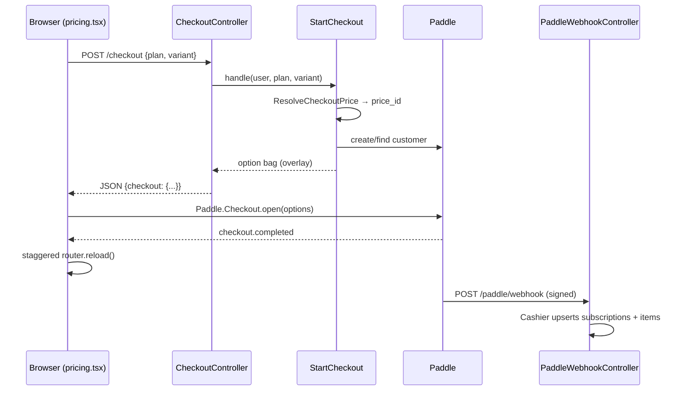
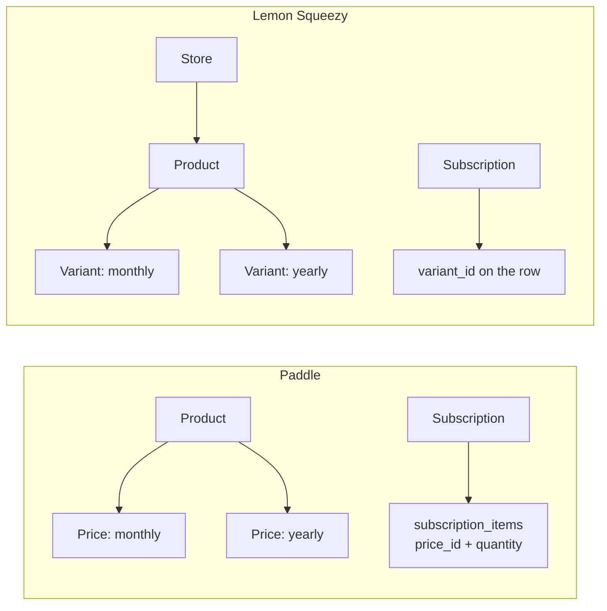

# Lemon Squeezy Integration Research

What it would take to bill DroneVerse through Lemon Squeezy instead of — or
alongside — Paddle, what that buys, and why the recommendation is to not do it.

This is a decision document. For how billing works today, see
[architecture.md](architecture.md) §3.4 and §5. For what the product sells, see
[pricing.md](pricing.md).

**Contents**

1. [Executive summary](#1-executive-summary)
2. [The Paddle integration as it stands](#2-the-paddle-integration-as-it-stands)
3. [Lemon Squeezy, as a platform](#3-lemon-squeezy-as-a-platform)
4. [Component-by-component mapping](#4-component-by-component-mapping)
5. [Integration steps, if you proceed](#5-integration-steps-if-you-proceed)
6. [Migration and coexistence](#6-migration-and-coexistence)
7. [Risks and open questions](#7-risks-and-open-questions)

---

## 1. Executive summary

**Recommendation: do not migrate. Stay on Paddle.**

The technical case for Lemon Squeezy is real but small. The strategic case
against it is large, and it is the acquisition.

Stripe acquired Lemon Squeezy in July 2024. In February 2026 Stripe announced
**Managed Payments**, its own merchant-of-record product. As of the April 2026 changelog, Managed
Payments is generally available to all digital businesses, covering indirect tax
in 80+ countries. Lemon Squeezy's own 2026 update frames Managed Payments as the
destination and confirms the team is building migration paths from Lemon Squeezy
into it. There is no announced sunset date and Lemon Squeezy is still onboarding
new stores (KYC/KYB review, typically 1–2 business days), but the direction of
travel is not ambiguous: Lemon Squeezy is the acquired product, Managed Payments
is the strategic one, and the vendor is telling its heavy users to plan for a
move.

Adopting a payment provider is a multi-year commitment. Subscribers cannot be
moved between merchants of record without re-collecting card details — an MoR is
the legal seller, so the mandate belongs to it, not to us. Choosing a provider
whose own roadmap points at a successor product means signing up to do that
migration twice.

Set against that, what would actually be gained:

| | Paddle (today) | Lemon Squeezy |
| --- | --- | --- |
| Merchant of record | Yes | Yes |
| Headline fee | 5% + $0.50, all-in | 5% + $0.50 **plus** +1.5% international, +0.5% subscriptions, +1.5% PayPal |
| Laravel package | `laravel/cashier-paddle` ^2.8, first-party Laravel | `lemonsqueezy/laravel` 1.9.0, community-maintained (Dries Vints, Steve McDougall) |
| Laravel 13 / PHP 8.5 | Supported | Supported (1.9.0, 2026-03-20) |
| Package release cadence | Active | One release in the twelve months to 2026-03 |
| Seat/quantity billing | `subscription_items` with quantity | **No subscription-items table; no quantity API in the package** |
| Usage-based billing | Cashier supports it | Platform supports it; **the Laravel package does not** |
| Checkout failure events | `checkout.error` / `checkout.failed` | **None** — only `Checkout.Success` |

Note the fee row carefully. DroneVerse is sold in USD to a browser-based
audience that will be substantially non-US. On a $19/month subscription bought
from outside the US, Lemon Squeezy charges 5% + 1.5% international + 0.5%
subscription + $0.50 ≈ **$1.83**, against Paddle's 5% + $0.50 = **$1.45**.
Lemon Squeezy is roughly 26% more expensive per transaction for the exact
traffic this product expects. It is not the cheaper option.

The two places Lemon Squeezy would genuinely be better are worth naming, because
they are the honest counter-argument:

- **Checkout is a URL, not an options bag.** `Checkout::url()` returns a
  server-generated link. That is a cleaner fit for an Inertia app than Paddle's
  "hand a JSON option bag to a script on the page" model, and it removes the
  `BuildPaddleClientConfig` / `usePaddle` machinery entirely for the redirect
  case.
- **No domain approval.** Paddle requires approving each domain that may open a
  checkout; `use-paddle.ts:60-78` exists partly because of the `E-403` failure
  that misconfiguration produces. Lemon Squeezy has no equivalent hurdle.

Neither is worth a merchant-of-record migration.

**If the underlying motivation is dissatisfaction with Paddle** — approval
friction, the domain allowlist, opaque support — the option to evaluate is
**Stripe Managed Payments**, not Lemon Squeezy — it is the product Lemon Squeezy
is being folded toward, and it sits on `cashier-stripe`, which is first-party
Laravel and maintained at the same cadence as the framework.

> **Correction, since answered.** This section originally claimed Managed
> Payments charges "the same 5% + $0.50". That is wrong: Managed Payments is a
> **3.5% add-on on top of** standard Stripe processing fees, stacking to ~8.7%
> domestic and ~11.2% international against Paddle's flat 7.6%. The follow-up
> research is in
> [stripe-managed-payments-research.md](stripe-managed-payments-research.md),
> and its answer is also *stay on Paddle* — on cost, and because Managed
> Payments blocks Phase 7 seats by carving out proration invoice items. What
> remains correct below is that going to Lemon Squeezy would be a detour through
> a platform whose vendor has already told you where it is heading.

---

## 2. The Paddle integration as it stands

Cashier Paddle (Billing v2), wired through this repository's Action pattern. The
whole surface is about ten files.

### 2.1 Flow



The important detail is the split: the browser learns that payment succeeded,
but the *entitlement* is granted by the webhook, which arrives on its own
schedule. `pricing.tsx:191-205` handles that by re-loading at 2s, 5s and 10s and
stopping as soon as the plan changes. `StartCheckout` deliberately sets no
`successUrl` (`app/Actions/StartCheckout.php:76-84`) so the page survives long
enough to do that polling.

### 2.2 Where each concern lives

| Concern | File | Notes |
| --- | --- | --- |
| Route table | `routes/billing.php:15-33` | `pricing` public; checkout throttled `20,1` |
| Price catalogue | `config/plans.php:29-58` | env-sourced price IDs, never DB rows |
| Plan vocabulary | `app/Enums/Plan.php` | `fromPriceId()` :31, `priceId()` :212, `variantFor()` :225 |
| Price selection | `app/Actions/ResolveCheckoutPrice.php:27-43` | the only place a price ID is chosen |
| Checkout construction | `app/Actions/StartCheckout.php:31-93` | returns Paddle.js option bag; forces `displayMode: overlay` |
| Checkout HTTP | `app/Http/Controllers/CheckoutController.php:24-43` | JSON, not Inertia — the page must stay mounted |
| Request validation | `app/Http/Requests/CheckoutRequest.php` | accepts `plan` + `variant` only; never a price |
| Entitlement | `app/Actions/ResolvePlanForUser.php:34-109` | override → subscription → Starter |
| Memoisation | `app/Concerns/HasPlan.php:29-70` | per-instance, `forgetPlan()` to drop |
| Billing page data | `app/Actions/BuildBillingSummary.php:28-179` | plan, subscription, 24 transactions |
| Cancel / resume / card | `app/Http/Controllers/Settings/SubscriptionController.php` | `Inertia::location()` for the hosted card page, :88-101 |
| Client bootstrap | `app/Actions/BuildPaddleClientConfig.php:28-36` | `token` + `sandbox`; null token = "checkout unavailable" |
| Webhook | `app/Http/Controllers/PaddleWebhookController.php:28-34` | signature verification made **unconditional** |
| Container binding | `app/Providers/AppServiceProvider.php:32` | binds Cashier's controller to ours |
| Script loading | `resources/js/hooks/use-paddle.ts:103-199` | on-demand, idempotent, error-aware |
| Client types | `resources/js/types/billing.ts` | `PaddleConfig`, `BillingSubscription`, … |

Tables: `customers`, `subscriptions`, `subscription_items`, `transactions`
(Cashier's four, `database/migrations/2019_05_03_*`), plus
`users.plan_override` (`2026_07_28_090305_add_plan_override_to_users_table.php`).

### 2.3 The two decisions worth preserving

**Fail-closed webhooks.** Cashier applies `VerifyWebhookSignature` only
`if (config('cashier.webhook_secret'))`. An environment that forgets the secret
therefore accepts *any* POST to `/paddle/webhook`, and whoever finds the URL can
grant themselves a subscription. `PaddleWebhookController` applies the middleware
unconditionally, and `tests/Feature/PaddleWebhookTest.php:80` pins that
behaviour. **`lemonsqueezy/laravel` has the identical flaw** — its
`WebhookController::__construct()` also guards on
`config('lemon-squeezy.signing_secret')` — so this subclass has to be
re-implemented against the Lemon Squeezy package, not dropped.

**The browser never names a price.** `CheckoutRequest` accepts a tier and a
period; `ResolveCheckoutPrice` decides what that costs. Every discount the
pricing copy promises has one place to live. This survives a provider change
unchanged, and is the single strongest reason the migration is *tractable* at
all: the client-facing contract mentions no Paddle concept.

### 2.4 Test coverage that would need rewriting

`tests/Feature/PaddleWebhookTest.php` (200 lines), `BillingTest.php` (341),
`PricingTest.php` (244), `EntitlementTest.php` (252), plus
`resources/js/hooks/use-paddle.test.ts`. Roughly 1,000 lines of PHP tests, of
which the entitlement and pricing suites are largely provider-agnostic and the
webhook and billing suites are not.

---

## 3. Lemon Squeezy, as a platform

### 3.1 The company, in 2026

- **July 2024** — Stripe acquires Lemon Squeezy.
- **Through 2025** — Lemon Squeezy continues as an independent product with its
  own dashboard, API and MoR entity ("Lemon Squeezy, LLC").
- **February 2026** — Stripe announces **Managed Payments**, its own MoR, at
  3.5% *on top of* standard processing fees, enabled by a single parameter on a
  Checkout Session.
- **April 2026** — Managed Payments reaches general availability for all digital
  businesses; indirect tax handled in 80+ countries.
- **Today** — both coexist. Lemon Squeezy still accepts new stores. Its founder
  has confirmed migration paths to Managed Payments are being built. No end date
  has been announced, and none has been ruled out.

The reading that matters for a *new* integration: Lemon Squeezy is in maintenance
posture. The Laravel package reflects this — one release in the year to March
2026 (1.9.0, which was a Laravel 13 compatibility bump).

### 3.2 The Laravel package

`lemonsqueezy/laravel` **1.9.0** (2026-03-20). Requires PHP
`~8.2|~8.3|~8.4|~8.5` and `laravel/framework ^11|^12|^13`. **Compatible with
this application as-is** — Laravel 13.20, PHP 8.5. Authored by Dries Vints,
maintained by Steve McDougall; MIT.

Config (`config/lemon-squeezy.php`): `api_key`, `signing_secret`, `path`
(default `lemon-squeezy`), `store`, `redirect_url`, `currency_locale`. Note what
is *absent*: no client-side token and no sandbox flag. Test mode is a dashboard
toggle and a mode-scoped API key, so "which environment am I in" is not
expressible in config the way `cashier.sandbox` is.

Migrations published — five tables:

| Table | Purpose |
| --- | --- |
| `lemon_squeezy_customers` | `billable` morph, `lemon_squeezy_id`, `trial_ends_at` |
| `lemon_squeezy_subscriptions` | `billable` morph, `type`, `status`, **`product_id`, `variant_id` on the row**, card brand/last four, `pause_mode`, `pause_resumes_at`, `trial_ends_at`, `renews_at`, `ends_at` |
| `lemon_squeezy_orders` | `product_id`, `variant_id`, `order_number`, `currency`, `subtotal`, `discount_total`, `tax`, `total`, `status`, `receipt_url`, `refunded_at`, `ordered_at` |
| `lemon_squeezy_license_keys` | unused by this product |
| `lemon_squeezy_license_key_instances` | unused by this product |

**There is no `subscription_items` table.** A Lemon Squeezy subscription carries
exactly one variant. See §7 for why that matters here.

API surface, abbreviated:

```php
$user->checkout($variant, $options, $custom);         // → Checkout
$user->subscribe($variant, $type, $options, $custom); // → Checkout
$user->charge($amount, $variant);                     // custom-price one-off
$user->customerPortalUrl();
$user->subscribed($type, $variant);
$user->subscription()->valid() | cancelled() | onGracePeriod() | pastDue()
                    | onTrial() | paused() | expired() | hasVariant($id);
$user->subscription()->swap($product, $variant) | swapAndInvoice() | noProrate();
$user->subscription()->cancel() | resume() | pause() | unpause();
$user->subscription()->updatePaymentMethodUrl();
$user->orders;  // ->paid() ->refunded() ->total() ->receipt_url
```

`Checkout` is fluent and terminates in `url()` (an API call returning a hosted
checkout URL), `redirect()` (303), or `Responsable`. Customisation:
`withName`, `withEmail`, `withBillingAddress`, `withTaxNumber`,
`withDiscountCode`, `withProductName`, `withDescription`, `withThankYouNote`,
`redirectTo`, `expiresAt`, `withButtonColor`, `embed()`, `dark()`,
`withoutSubscriptionPreview()`. Custom data goes through `withCustomData()`;
`billable_id`, `billable_type` and `subscription_type` are reserved.

**Usage-based billing is not in the package.** The platform supports it (metered
variants, `/usage-records` endpoints, four aggregation modes), but a grep of
`src/` finds no usage-record code. Any metered billing would be hand-rolled
against the HTTP API.

### 3.3 Lemon.js and the Inertia frontend

The package's shipped frontend integration is Blade-only: a `@lemonJS` directive
emitting `<script src="https://app.lemonsqueezy.com/js/lemon.js" defer>` and an
`<x-lemon-button>` component that renders
`<a href="{checkout url}" class="lemonsqueezy-button">`. Neither is usable from
React. The React path is the raw global:

```js
LemonSqueezy.Setup({ eventHandler: (event) => { /* event.event */ } });
LemonSqueezy.Url.Open(url);   // opens the overlay
LemonSqueezy.Url.Close();
LemonSqueezy.Refresh();       // re-binds .lemonsqueezy-button — SPA hook
```

Events available: `Checkout.Success` (carries the Order object in `event.data`),
`PaymentMethodUpdate.Mounted`, `PaymentMethodUpdate.Closed`,
`PaymentMethodUpdate.Updated`.

**That list has no failure event.** `use-paddle.ts` exists in large part to catch
`checkout.error` / `checkout.failed` and surface Paddle's `detail` string —
`transaction_default_checkout_url_not_set`, `E-403` for an unapproved domain —
because otherwise a misconfigured *seller account* looks to everyone like a
declined card. Lemon.js gives you nothing equivalent. A `use-lemon-squeezy.ts`
would be simpler and blinder.

There is one structural upside: because `Checkout::url()` is produced
server-side, the overlay is opened with a single opaque URL. The client never
receives a settings object it could tamper with, and the redirect fallback
(`Inertia::location($checkout->url())`) needs no JavaScript at all.

### 3.4 Webhooks

Endpoint: `POST /lemon-squeezy/webhook`, registered by the package's service
provider and CSRF-exempt (must be added to the `except` list in
`bootstrap/app.php`).

Signature: `X-Signature` header, `hash_hmac('sha256', $rawBody, $signingSecret)`,
compared with `hash_equals()`. Correct construction — and, as noted, applied
conditionally.

Events handled and persisted:

| Event | Effect |
| --- | --- |
| `order_created` | creates `lemon_squeezy_orders` row |
| `order_refunded` | syncs refund status/timestamp |
| `subscription_created` | creates subscription; ends generic trial; assigns customer's LS id |
| `subscription_updated`, `_cancelled`, `_resumed`, `_expired`, `_paused`, `_unpaused` | sync state |
| `subscription_payment_success`, `_failed`, `_recovered` | dispatch events only — **nothing persisted** |
| `license_key_created`, `_updated` | license tables |

Each dispatches a typed Laravel event (`SubscriptionCreated`, `OrderRefunded`, …)
plus generic `WebhookReceived` / `WebhookHandled`.

**Idempotency: none.** No dedupe, no replay window, no event-id table. It relies
on `firstOrCreate` plus unique constraints on `lemon_squeezy_id`. Lemon Squeezy
retries failed deliveries, so a slow handler can be re-entered. This is not worse
than Cashier Paddle, but it is not better, and any per-event side effect added
later (an email, a credit grant) has to carry its own guard.

Local development: `php artisan lmsqueezy:listen` provisions a tunnel and
registers a temporary webhook; `--cleanup` removes it.

### 3.5 Products, variants and stores vs Paddle's model



Practical differences:

- A **store** sits above everything, and its ID is required config
  (`LEMON_SQUEEZY_STORE`). Paddle has a seller ID but Cashier does not need it
  scoping every call.
- **Variant ≈ Price.** A Pro-monthly and a Pro-yearly are two variants of one
  product, exactly as they are two prices of one Paddle product. The mapping
  `config/plans.php` performs is unchanged in shape; only the ID it holds
  changes. `Plan::fromPriceId()` becomes `Plan::fromVariantId()` and nothing
  above it moves.
- **No line items.** The subscription *is* the variant. Paddle's
  `subscription_items` table lets one subscription carry a base tier plus a
  quantity-priced seat line — which is exactly how `config/plans.php:54-55`
  plans to sell Team's `$5/month per additional seat`. Lemon Squeezy has no
  equivalent; quantity is a checkout-time value on a single variant, and the
  package exposes no API to change it afterwards.

### 3.6 Merchant of record and tax

Functionally at parity with Paddle. Lemon Squeezy, LLC is the legal seller of
record; it registers, collects and remits VAT/GST/sales tax, handles fraud and
chargebacks, and issues invoices in its own name. Supports tax-inclusive pricing,
B2B reverse charge via `withTaxNumber()`, and 80+ jurisdictions. Payouts via
Stripe (free for US bank accounts, 1% outside the US) or PayPal ($0.50 US flat,
3% capped at $30 outside).

The MoR relationship is the reason a migration is expensive: card mandates are
held by the merchant of record, so existing Paddle subscribers cannot be
transferred. See §6.

### 3.7 Test mode

A dashboard toggle (bottom-left of the admin panel) that switches the store into
a parallel test dataset — separate products, orders, subscriptions and webhooks.
API keys are mode-scoped: a test key only reaches test data, a live key only
reaches live data. Same API host either way.

That is *close* to Paddle's sandbox, with one operational difference. Paddle's
sandbox is a different host and Cashier models it as a boolean
(`cashier.sandbox`, read at `BuildPaddleClientConfig.php:34`). Lemon Squeezy's
mode is carried implicitly by which API key you configured, so "am I about to
charge real money?" is not a question the application can answer from config.
For an application that already treats an unconfigured token as
"checkout is unavailable" (`use-paddle.ts:110-117`), that is a small regression
in legibility.

---

## 4. Component-by-component mapping

| Today | Under Lemon Squeezy | Verdict |
| --- | --- | --- |
| `composer require laravel/cashier-paddle` | `composer require lemonsqueezy/laravel` | swap |
| `config/cashier.php` | `config/lemon-squeezy.php` | rewrite; fewer keys, no sandbox flag |
| `PADDLE_*` env keys (`.env.example:65-79`) | `LEMON_SQUEEZY_API_KEY`, `_STORE`, `_SIGNING_SECRET`, `_PATH` | fewer; **no client-side token** |
| `config/plans.php` price IDs | same file, variant IDs | rename only; structure survives |
| `Plan::fromPriceId()` / `priceId()` / `variantFor()` | `fromVariantId()` / `variantId()` / … | mechanical rename; note the unfortunate collision with this repo's existing "variant" meaning (billing period) |
| `ResolveCheckoutPrice` | unchanged in shape — returns a variant ID | **survives** |
| `StartCheckout` → Paddle option bag | → `$user->subscribe($variantId)->withCustomData([...])->embed()->url()` | simplifies; returns a string |
| `CheckoutController` JSON `{checkout: {...}}` | JSON `{checkout: {url: "..."}}` | narrower payload |
| `CheckoutRequest` | unchanged | **survives** |
| `BuildPaddleClientConfig` | **deleted** — nothing to bootstrap client-side but the script | net removal |
| `usePaddle()` hook | `useLemonSqueezy()` — load `lemon.js`, `Setup({eventHandler})`, `Url.Open(url)` | simpler; **loses failure reporting** |
| `ResolvePlanForUser::fromSubscription()` (:70-91, joins `subscription_items`) | reads `variant_id` off the subscription row | **simplifies** — one query, no join |
| `BuildBillingSummary::subscribedPriceId()` (:144-152) | `$subscription->variant_id` | **deleted** |
| `BuildBillingSummary::nextPayment()` (:115-131) | no equivalent; `$subscription->renews_at` gives the date, **not the amount** | **regression** — the billing page loses "Renews 12 Sep for $19.00" |
| `Transaction` model / `transactions` table | `Order` model / `lemon_squeezy_orders`; `receipt_url` is a bonus | swap; receipts improve |
| `SubscriptionController::edit()` → `paymentMethodUpdateUrl()` | `$subscription->updatePaymentMethodUrl()` | **survives**, same `Inertia::location()` treatment |
| `CancelSubscription` / `ResumeSubscription` | `cancel()` / `resume()`, same grace-period semantics | **survives** |
| `PaddleWebhookController` (unconditional signature) | same subclass against LS's controller | **must be re-done** — LS has the identical fail-open bug |
| `Cashier::formatAmount()` | `LemonSqueezy::formatAmount()` | same signature |
| `subscription_items` + quantity (Team seats, Phase 7) | **nothing** | **blocker for Phase 7 as designed** |

Read the column of verdicts: most of the domain layer survives untouched, because
this repo already keeps provider concepts behind `Plan`, `ResolveCheckoutPrice`
and `ResolvePlanForUser`. The costs concentrate in three places — the next-payment
line on the billing page, checkout failure reporting, and per-seat pricing.

---

## 5. Integration steps, if you proceed

Ordered so that nothing is half-migrated at any commit boundary. Everything below
follows the conventions in `CLAUDE.md`: Actions hold the logic, FormRequests hold
the validation, controllers hold HTTP shape only, and every step lands with tests.

### 5.1 Provider setup

1. Create a Lemon Squeezy store; complete KYC/KYB (1–2 business days).
2. Toggle **Test mode**. Create one product ("DroneVerse Pro") with two variants,
   `monthly` and `yearly`, at $19 and $190. Add `monthly_launch` /
   `yearly_launch` variants at $15/$150 to preserve the Phase 4 launch pricing
   that `config/plans.php:42-43` reserves.
3. Create a test-mode API key and a webhook (URL + signing secret + event list).

### 5.2 Package and configuration

```bash
composer require lemonsqueezy/laravel
php artisan vendor:publish --tag="lemon-squeezy-migrations"
php artisan vendor:publish --tag="lemon-squeezy-config"
php artisan migrate
```

Env keys to add to `.env.example` alongside the existing block at lines 65-79:

```
LEMON_SQUEEZY_API_KEY=
LEMON_SQUEEZY_STORE=
LEMON_SQUEEZY_SIGNING_SECRET=

LEMONSQUEEZY_VARIANT_PRO_MONTHLY=
LEMONSQUEEZY_VARIANT_PRO_YEARLY=
LEMONSQUEEZY_VARIANT_PRO_MONTHLY_LAUNCH=
LEMONSQUEEZY_VARIANT_PRO_YEARLY_LAUNCH=
```

Add `lemon-squeezy/*` to the CSRF `except` list in `bootstrap/app.php`.

`config/plans.php` keeps its shape; only the `env()` calls change. The comment
block at lines 7-27 explaining why price IDs are config and never rows applies
verbatim to variant IDs and should stay.

### 5.3 Model and entitlement

On `App\Models\User`, replace `Laravel\Paddle\Billable` with
`LemonSqueezy\Laravel\Billable` (currently `app/Models/User.php:47`). `HasPlan`
is untouched.

Rewrite `ResolvePlanForUser::fromSubscription()`. It gets shorter — no
`SubscriptionItem` join, just `variant_id` off the valid subscriptions:

- query `LemonSqueezy\Laravel\Subscription` by `whereMorphedTo('billable', $user)`
- filter to valid statuses (`active`, `on_trial`, and `past_due` per policy)
- map `variant_id` through `Plan::fromVariantId()`
- reduce to the most generous plan, exactly as today (:87-90)

Keep the direct query rather than `$user->subscriptions` — the lazy-loading
guard reasoning at :96-99 is unchanged.

Note that the package's `Subscription` model has no `valid()` *scope*, only a
`valid()` instance method plus `active()` / `onTrial()` / `pastDue()` scopes. The
"IDs of valid subscriptions" query at :103-109 must be rebuilt from those.

### 5.4 Checkout

`ResolveCheckoutPrice` becomes `ResolveCheckoutVariant` — same contract, same
null-is-fatal discipline, returns a variant ID.

`StartCheckout` returns a URL string rather than an option bag:

```php
public function handle(User $user, Plan $plan, string $variant): ?string
{
    $variantId = $this->variants->handle($user, $plan, $variant);

    if ($variantId === null) {
        return null;
    }

    $user->loadMissing('customer');

    return $user->subscribe($variantId)
        ->withCustomData(['plan' => $plan->value, 'variant' => $variant])
        ->embed()
        ->url();
}
```

Two things to be careful of. `withCustomData()` rejects the reserved keys
`billable_id`, `billable_type`, `subscription_type` — none of which this app
uses, but a future seat/team key must avoid them. And `url()` makes a *live API
call*, which `StartCheckout` currently does not do synchronously in the same way;
the existing `throttle:20,1` on `routes/billing.php:22` becomes more load-bearing,
and a `Throwable` guard belongs around it.

`CheckoutController` keeps its JSON shape and its `ValidationException` on null
(:30-40) — the message that deliberately does not say *why* a plan is
unavailable stays as-is.

### 5.5 Frontend

Delete `BuildPaddleClientConfig` and the `paddle` prop from `PricingController`
(`app/Http/Controllers/PricingController.php:26,32`). Nothing needs to be handed
to the browser but the script.

New `resources/js/hooks/use-lemon-squeezy.ts`, structured like the existing hook:
load `https://app.lemonsqueezy.com/js/lemon.js` once by ID, guard against double
mount under strict mode, call `LemonSqueezy.Setup({ eventHandler })` on load,
expose `{ ready, openCheckout(url) }` backed by `LemonSqueezy.Url.Open`.

In `pricing.tsx`, `startCheckout` (:230-241) changes only in what it passes:
`onSuccess: (response) => openCheckout(response.checkout.url)`. The
staggered-reload logic at :191-205 is unchanged and still necessary — the
webhook still lands after `Checkout.Success`.

`resources/js/types/billing.ts` loses `PaddleConfig` and gains
`{ checkout: { url: string } }`.

**Accept the loss, or work around it.** With no failure event, `onCheckoutFailed`
(:214-216) has no trigger. The available substitute is server-side: catch the
`LemonSqueezyApiError` from `url()` and return a real validation error, which at
least covers misconfiguration. It does not cover a checkout that opens and then
breaks in the overlay.

### 5.6 Billing settings page

`BuildBillingSummary` changes in three places:

- `subscribedPriceId()` (:144-152) — delete; read `$subscription->variant_id`.
- `transactions()` (:159-174) — read `$user->orders` instead of
  `Transaction::query()`. Add `receipt_url` to the shape; the client type
  `BillingTransaction` gains a `receiptUrl` field and the page gains a link.
- `nextPayment()` (:115-131) — no API for this. Return
  `{ amount: null, date: $subscription->renews_at }` and change
  `PlanSummary` in `settings/billing.tsx:132-134` to say "Renews 12 Sep" when
  the amount is absent. `BillingSubscription.nextPayment` in
  `types/billing.ts:76` becomes `{ amount: string | null; date: string | null }`.

`SubscriptionController` is a near drop-in: `cancel()`, `resume()` and
`updatePaymentMethodUrl()` all exist with the same semantics, including the
grace-period behaviour `CancelSubscription`/`ResumeSubscription` rely on. The
`Inertia::location()` reasoning at :80-87 applies unchanged.

`$user->customerPortalUrl()` is a genuinely new capability with no Paddle
equivalent in use here — worth exposing as a "Manage billing" link, and it would
let a later phase retire some of the hand-built settings UI.

### 5.7 Webhook

Create `App\Http\Controllers\LemonSqueezyWebhookController` extending
`LemonSqueezy\Laravel\Http\Controllers\WebhookController`, applying
`LemonSqueezy\Laravel\Http\Middleware\VerifyWebhookSignature` unconditionally in
the constructor — a direct port of `PaddleWebhookController:28-34`, for the same
reason and with the same doc comment. Bind it in `AppServiceProvider` next to
line 32.

Events to subscribe in the dashboard: `subscription_created`,
`subscription_updated`, `subscription_cancelled`, `subscription_resumed`,
`subscription_expired`, `subscription_paused`, `subscription_unpaused`,
`subscription_payment_success`, `subscription_payment_failed`, `order_created`,
`order_refunded`.

Add a listener that calls `$user->forgetPlan()` on subscription events —
`CancelSubscription:32` and `ResumeSubscription:27` do this for the in-request
path, but the webhook path currently relies on the next request hydrating a fresh
`User`. That is still true, so this is belt-and-braces rather than a fix.

Port `tests/Feature/PaddleWebhookTest.php` wholesale, especially
`test_a_missing_webhook_secret_rejects_every_call_rather_than_accepting_them`
(:80) — it is the test that pins the one security decision the package gets
wrong.

### 5.8 Verification

`php artisan test --compact --filter='Billing|Pricing|Entitlement|Webhook'`,
`npm run test`, `vendor/bin/pint --dirty --format agent`, `composer types:check`.
Then a full sandbox purchase through `lmsqueezy:listen`, checking that the plan
lands within the 10s reload window.

---

## 6. Migration and coexistence

### 6.1 Existing subscribers cannot be moved

This is the hard constraint. Both providers are merchants of record, meaning each
is the legal seller and holds the card mandate. Paddle will not hand card
credentials to Lemon Squeezy, and vice versa. Every existing Paddle subscriber
must **re-enter payment details** in a Lemon Squeezy checkout.

The realistic playbook, and it is not cheap:

1. New signups go to Lemon Squeezy from day one.
2. Existing Paddle subscribers keep billing through Paddle indefinitely.
3. A campaign asks them to re-subscribe, usually sweetened (a free month, a
   locked price). Expect meaningful churn at this step — it is a fresh purchase
   decision, presented to people who already thought they were done deciding.
4. Cancel each Paddle subscription only once its Lemon Squeezy replacement has a
   successful first payment.
5. Retire Paddle when the last subscription has ended.

For a product with a small existing subscriber base this is manageable and now is
the cheapest it will ever be. For a product with a large one it is a growth-team
project, not an engineering one.

### 6.2 Running both providers in parallel

Both packages *can* coexist — different tables, different routes, different
config namespaces, and no class-name collisions once imports are explicit.
`ResolvePlanForUser` becomes a three-branch resolution:

```
plan_override → Lemon Squeezy subscription → Paddle subscription → Starter
```

which is exactly the shape the method already has (:45-47), and exactly where the
comment at :40-44 anticipated a fourth branch for team membership. The most
generous plan wins, as today.

`BuildBillingSummary` is the awkward one: it must decide which provider a given
user's subscription belongs to and render accordingly. The cleanest form is a
`BillingProvider` enum plus one Action per provider behind a common return shape,
so the React page keeps a single prop contract and never learns which merchant
charged the card.

The pricing page has no branch at all — a user with a Paddle subscription sees
"Your current plan" from `BuildPricingCatalog::cta()` (:132-144) whichever
provider granted it.

The real cost of parallel operation is not code. It is two dashboards, two
reconciliation processes, two tax filings to check, two webhook endpoints to
monitor, and two sets of failure modes to be on call for.

### 6.3 Data model changes

Additive only — the Lemon Squeezy tables are new and namespaced, and nothing in
Cashier Paddle's four tables needs altering. `users.plan_override` is unchanged
and continues to outrank both providers.

The one addition worth making up front, whether or not both run in parallel, is a
`billing_provider` column or a derived accessor on `User`, so support tooling can
answer "where is this person billed?" without querying two schemas.

---

## 7. Risks and open questions

**Strategic — the one that decides it.** Lemon Squeezy is a post-acquisition
product whose parent has shipped a competing, strategically favoured
replacement. Migration paths *into* Managed Payments are being built. An
integration built now has a non-trivial chance of being migrated again within a
few years, and the second migration has the same re-collect-every-card cost as
the first.

**Phase 7 is blocked as designed.** `config/plans.php:50-55` sells Team as a base
subscription plus quantity-priced seats — a shape that requires per-subscription
line items with mutable quantity. Lemon Squeezy subscriptions carry one variant;
quantity is set at checkout and the package exposes no way to change it. Team
would have to be re-modelled as banded variants (a 10-seat variant, a 25-seat
variant, …) with `swap()` between bands, which is a pricing change, not an
implementation detail. **This should be settled before any migration, not during
one.**

**Usage-based billing is package-less.** Lemon Squeezy supports metered billing;
`lemonsqueezy/laravel` does not wrap it. If a future tier meters simulator
minutes or Python runs, that is a hand-rolled HTTP client against
`/usage-records`, plus the reconciliation code around it.

**The billing page loses a line.** No API returns the next charge *amount*. The
"Renews 12 Sep for $19.00" line becomes "Renews 12 Sep". Small, but it is the one
number `BuildBillingSummary` currently leaves the building to fetch (:104-114),
and it will be noticed.

**Checkout failures go quiet.** Lemon.js emits no error event. A misconfigured
account, a rejected checkout, an expired session — all render Lemon Squeezy's own
frame and tell the application nothing.

**Package maintenance.** One release in the year to March 2026. It is
well-written and it tracks Laravel majors, but it is not first-party Laravel the
way `cashier-paddle` is, and the maintainer bandwidth question is real given the
acquisition.

**Fee increase for the actual customer mix.** +1.5% international and +0.5%
subscription on a globally-sold subscription product. Roughly 26% more per
transaction than Paddle for a non-US buyer at $19/month.

**Terminology collision.** This codebase already uses "variant" to mean *billing
period* (`Plan::variants()` returns `['monthly', 'yearly']`, and
`resources/js/types/billing.ts:4` types `PlanVariant`). Lemon Squeezy uses
"variant" to mean *the priced thing*. Every method signature that mentions both
becomes ambiguous. If this proceeds, rename one of them first — probably ours, to
`period` — as a standalone commit.

### Open questions

1. What is the actual motivation? ~~If it is Paddle's approval friction or the
   domain allowlist, **Stripe Managed Payments deserves the research budget
   instead**.~~ **Answered** in
   [stripe-managed-payments-research.md](stripe-managed-payments-research.md):
   Managed Payments costs more, not the same, and blocks Phase 7 seats. The
   motivation is presumably operational, and the fix is presumably a
   conversation with Paddle support rather than any migration.
2. How many paying Paddle subscribers exist today? Under ~20, migration is a
   weekend and a discount code. Over ~200, it is a quarter and a churn forecast.
3. Is Team-with-seats (Phase 7) still the intended shape, or would banded
   variants do? The answer changes whether Lemon Squeezy is even viable.
4. Does the Lemon Squeezy store's KYB pass for the operating entity, in its
   jurisdiction, for this product category? Worth confirming before any code.
5. Is `LemonSqueezy::formatAmount()` a true drop-in for `Cashier::formatAmount()`
   including the `min_fraction_digits` option used at
   `BuildPricingCatalog.php:84`? Both wrap `moneyphp/money`, but this needs
   checking rather than assuming.

---

## Sources

- [lemonsqueezy/laravel on GitHub](https://github.com/lmsqueezy/laravel) — package source, migrations, webhook controller, middleware
- [lemonsqueezy/laravel on Packagist](https://packagist.org/packages/lemonsqueezy/laravel) — 1.9.0, `laravel/framework ^11|^12|^13`, PHP `~8.2–~8.5`
- [Lemon Squeezy fees](https://docs.lemonsqueezy.com/help/getting-started/fees)
- [Lemon Squeezy webhooks](https://docs.lemonsqueezy.com/help/webhooks)
- [Lemon.js methods](https://docs.lemonsqueezy.com/help/lemonjs/methods) and [events](https://docs.lemonsqueezy.com/help/lemonjs/handling-events)
- [Variants](https://docs.lemonsqueezy.com/help/products/variants) and [usage-based billing](https://docs.lemonsqueezy.com/help/products/usage-based-billing)
- [2026 Update: Lemon Squeezy + Stripe Managed Payments](https://www.lemonsqueezy.com/blog/2026-update)
- [Stripe acquires Lemon Squeezy](https://techcrunch.com/2024/07/26/stripe-acquires-payment-processing-startup-lemon-squeezy/)
- [Stripe Managed Payments general availability, April 2026](https://docs.stripe.com/changelog/dahlia/2026-04-22/managed-payments)
